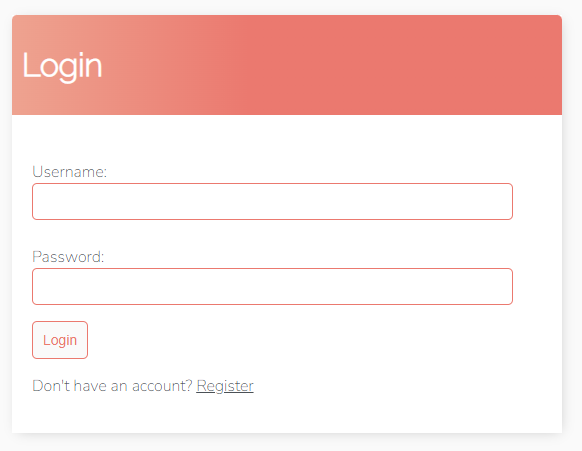
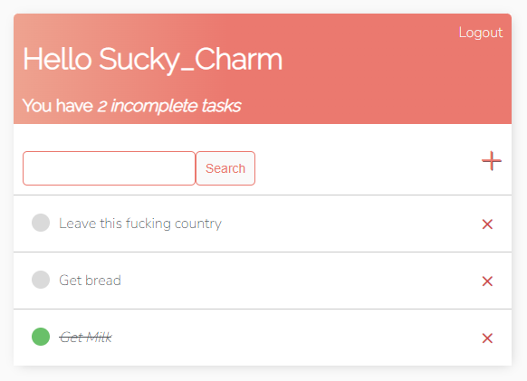

# To Do List

Todo List is an app with the ability to Log In and add, edit and delete tasks.

## How it looks like
<br>
<p align="center">
    
    
</p>
<br>

## Installation

If you wanna check how it works:

```bash
python install django
```

```bash
git clone "https://github.com/timsmr/todo_list_project.git"
```

```bash
..\todo_list_project>python manage.py runserver
```

## License
[MIT](https://choosealicense.com/licenses/mit/)